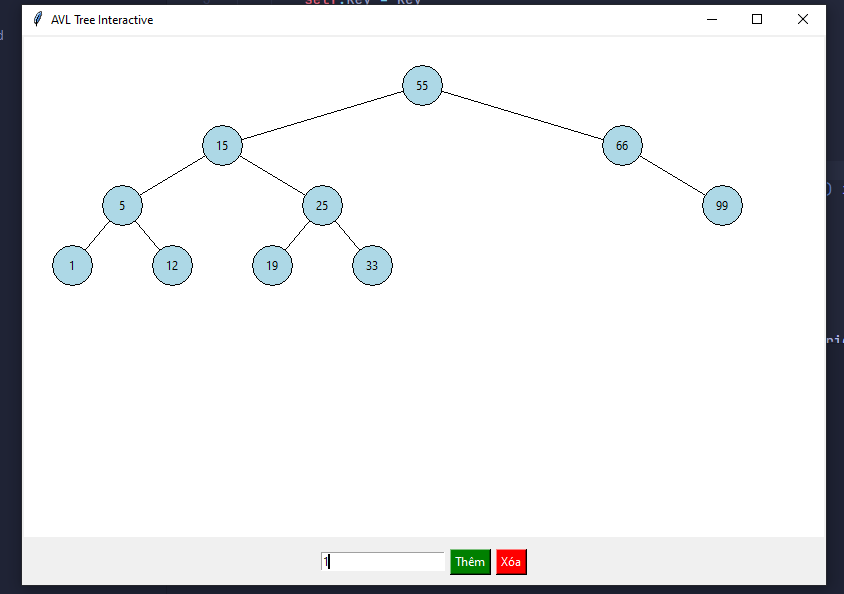
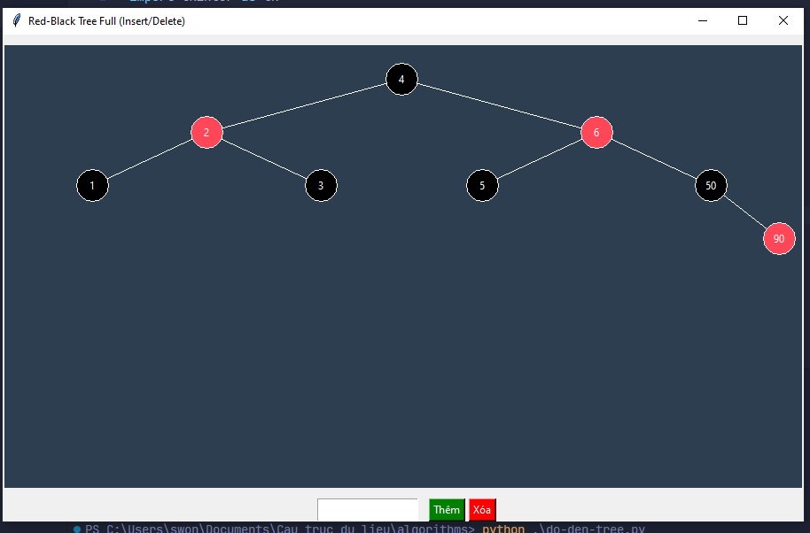
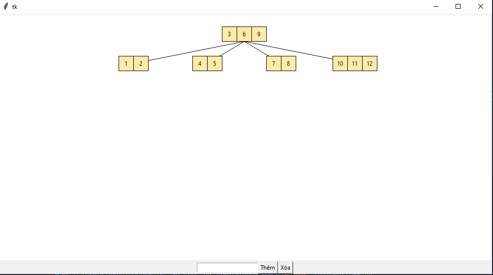
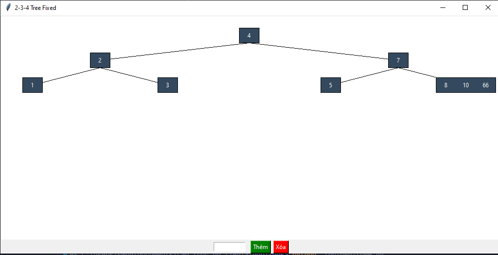

# Thuật toán Cây dữ liệu
Khi thực hiện thêm hoặc xóa phần tử thì chương trình tự động cân bằng lại cây. 
Các thuật toán:
 - Cây nhị phân tìm kiếm cân bằng AVL 
   

      
   

 - Cây nhị phân tìm kiếm Đỏ-Đen 
   

      
   

 - Cây B 
   

      
    

 - Cây 2-3-4 
   

      
   

